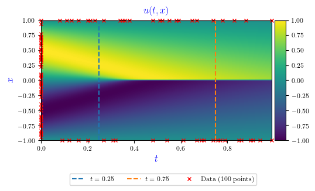
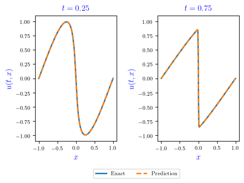
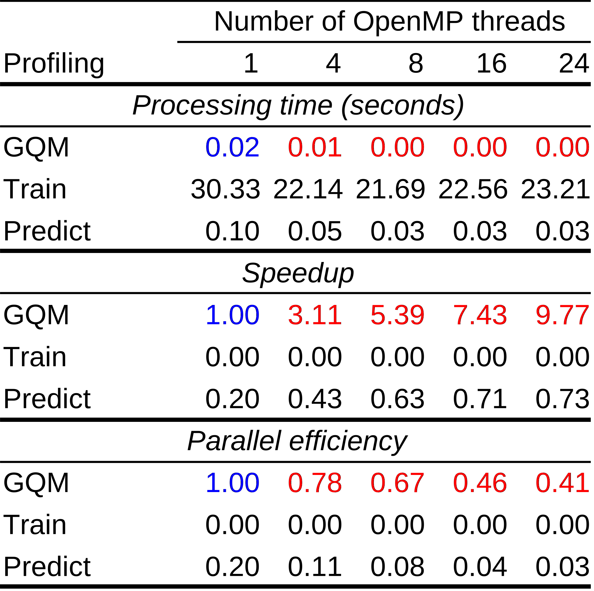
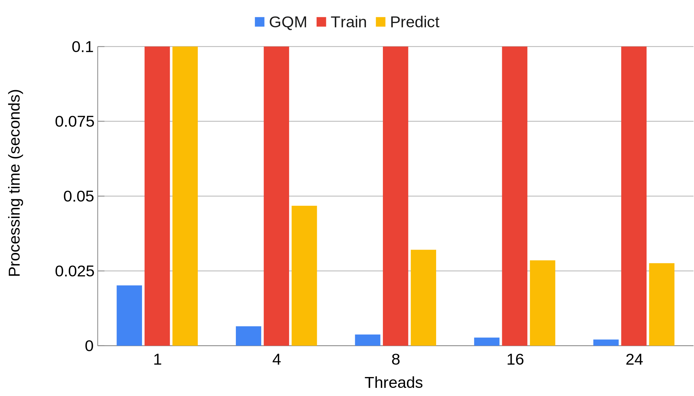
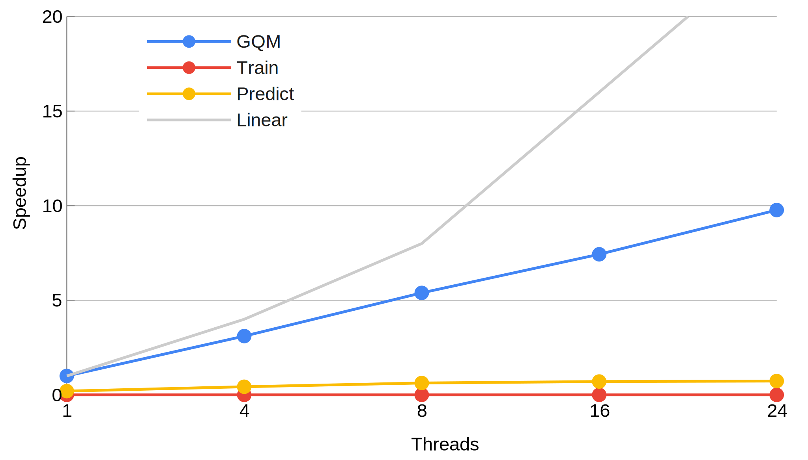

The PINN solution $u(t,x)$ is shown in [Figure&nbsp;1](#fig:bur1), with the time $t$ in the horizontal axis  and the spatial coordinate $x$ in the vertical axis. The red marks in the boundaries of the graph represent the 100 randomly assigned points (BC+IC) used for training. The 10,000 CPs randomly generated are not shown. The color scale refers to the velocity $u(x,t)$. The dashed vertical lines refer to 2 specific snapshots ($t=0.25$ and $t=0.75$). [Figure&nbsp;2](#fig:bur2) shows the superimposed solutions for PINN and GQM for these 2 snapshots, which are quite equivalent.

<figure id="fig:bur1">

<figcaption>
Figure 1. PINN solution for the velocity $u(t,x)$. The horizontal axis denotes time $t$, and the vertical axis, the coordinate $x$. The red marks in the boundaries of the graph represent the 100 randomly assigned points (BC+IC) used for training. The color scale refers to the velocity. The dashed vertical lines refer to 2 snapshots ($t=0.25$ and $t=0.75$).
</figcaption>
</figure>

<figure id="fig:bur2">

<figcaption>
Figure 2. Superimposed solutions for PINN and GQM for the $t=0.25$ and $t=0.75$ snapshots. PINN solution is labeled as Prediction (in orange), and GQM solution is labeled as Exact (in blue).
</figcaption>
</figure>

[Table&nbsp;1](#tab:resu) shows the processing times for the PINN and GQM solutions. PINN time is splitted into training time (Train) and prediction time (Predict). The singe-thread runtime of the GQM implementation was taken as reference. In all cases, the GQM implementation achieved the best performance, i.e. required less processing times, presented better speedups and parallel efficiencies, even if considering only the PINN prediction time.

<figure id="tab:resu">
<figcaption>
Table 1. Processing times, speedups and parallel efficiencies for the PINN and GQM solutions for different numbers of OpenMP threads. The GQM single-thread execution time was taken as a reference, highlighted in blue. Best values are highlighted in red.
</figcaption>

</figure>

 
<figure id="fig:time">
<figcaption>
Figure 3. Processing times (seconds) in function of number of OpenMP threads for the GQM and PINN implementations. "Train" refer to the PINN training phase, while "Predict" refers to the PINN test/prediction phase (for convenience, times above 0.1 seconds are not shown).
</figcaption>

</figure>

 
<figure id="fig:spee">
<figcaption>
Figure 4. Speedups in function of the number of OpenMP threads for the GQM and PINN implementations. The dotted line indicates the linear speedup. "Train" refer to the PINN training phase, while "Predict" refers to the PINN test/prediction phase.
</figcaption>

</figure>

 
<figure id="fig:effi">
<figcaption>
Figure 5. Parallel efficiencies in function of the number of OpenMP threads for the GQM and PINN implementations. "Train" refer to the PINN training phase, while "Predict" refers to the PINN test/prediction phase.
</figcaption>

</figure>
